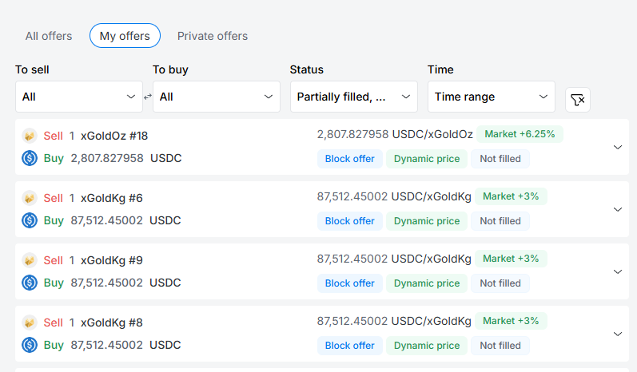

# Passport

In order to onboard on the platform we need to know about a user before using the protocol. User information and onboarding processes are managed via Passport.

Passport contains a user's personal details, verifications, trading allowances, connected addresses and other important account information.

Setting up a Passport is simple and requires users to connect a wallet, verify an Ethereum address, and verify their identity.

Setting up a **Business Account?** [**Learn more here**](businesses.md)**.**  

## Onboarding

Onboarding is the process of setting up your Passport for DeFi, and includes verifying your identity. It can be completed online in just a few minutes, similarly to opening a bank account.

.png>)

## Linking your Wallet

A wallet connects you to the Ethereum blockchain. Wallets enable users to easily associate and verify an Ethereum address with their Swarm account. Wallets are further used for easy viewing and transfer of asset balances, as well as interacting with smart contracts and protocols like Swarm.

.png>)

It's important to understand that wallets don't have custody of users' funds. Wallets are simply a tool for managing assets held on the blockchain in a specific address. This is called _self-custody_. Users are responsible for their assets, private keys, passwords and any other information they have used or provided to set up a wallet. Other than the data users are required to share for identification purposes, Swarm will never request access to any other private information such as private keys or passwords.

Swarm currently supports Metamask, Coinbase Wallet, Ledger, Trezor and many other web3 compatible wallets via the WalletConnect protocol. [Learn more about wallets from ethereum.org](https://ethereum.org/en/wallets/).

<figure><figcaption></figcaption></figure>

**Linking an existing MetaMask wallet:**

| .png>) | .png>) |
| ---------------------------------------- | --------------------------------------- |

Enter the password for the MetaMask account you would like to use. Then choose the address within your MetaMask account that you would like to connect to the Swarm Wallet. Connect this wallet and you will be automatically directed back to the Swarm Onboarding page. \\

***

### **Creating a new MetaMask wallet**

If you need to create a new MetaMask wallet, setting one up is easy. Add [Metamask](https://metamask.io) either as an add-on or extension to your browser application (Chrome, Brave, Firefox or Edge are the currently supported browsers for MetaMask) or to your mobile phone. It’s available through the [Metamask Website](https://metamask.io), [Apple App Store](https://apps.apple.com) or [Google Play](https://play.google.com/store/apps/details?id=io.metamask). MetaMask has a great [FAQ](https://metamask.io/faqs.html) and also more support [here](https://metamask.zendesk.com/hc/en-us). Then you can complete the above steps for connecting an existing MetaMask wallet.\\

***

**Verify your ETH address**\
\*\*\*\*Once you have a wallet connected, the platform will direct you to verify ownership of your ethereum address by signing a message with your wallet. This operation does not incur any network fees.

<figure><figcaption></figcaption></figure>

### Identity Verification

Our goal is to continuously improve the user experience on Swarm, and we know that identity verification is often a hassle. We've carefully selected our KYC partners to minimize the pain and get users up and running as quickly as possible.

<figure><figcaption></figcaption></figure>

**Identity Verification with Sum and Substance**

Sum and Substance is an established KYC vendor that provides easy identity verification via desktop or mobile. Most applications are approved in under 10 minutes, allowing you to start trading immediately.

You will be led through a straightforward process of entering personal information, uploading your Identification Documents, and a facial biometrics scan to for comparison purposes, and to protect you and your account from fraud.

Once account information is submitted, both automatic and manual checks are performed according to the Anti-Money Laundering and Financing Terrorism legislation that we are subject to as per our bank licensing regulations.

**4. Verifying your email address**

Once users have connected and verified their ETH wallet address and verified their identity, the last step in the onboarding process is to verify their email address. This is to prevent duplicate or fraudulent accounts, and will be checked against other information provided. \*\*\*\*

In most cases approval for initial limited trading is automatic and done in under 10 minutes. Unlimited trading may require extra verifications. Users should consult their Passport for specific instructions.
