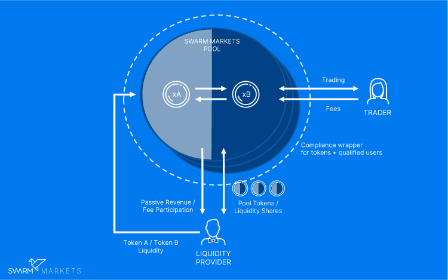

# Swarm DEX

Swarm is a compliant DeFi protocol. Our first product is an Automated Market Making (AMM) decentralized exchange (DEX) powered by the [Balancer Protocol](https://balancer.finance) and combined with compliance layers.

Automated market makers are smart contracts that create a liquidity pool of ERC20 tokens that are automatically traded through an algorithm rather than an order book. This replaces a traditional limit order book with a system where assets can be automatically exchanged for the current price of the pool.

In AMMs, both sides of the trade are pre-funded by on-chain liquidity pools. Providing liquidity - incentivized through earning transaction fees from trading activities - allows traders to seamlessly swap between tokens on-chain in a decentralized and transparent manner with no central custody. Unlike centralized exchanges (CEXs), AMMs exist only within smart contracts on the Ethereum blockchain.

A little more simply, AMMs allow users with excess assets (liquidity providers) to deposit these assets into a market for trading (a liquidity pool). Traders use these markets to swap one asset for another, paying the liquidity providers a small fee.

## Removing barriers to enhance the AMM model

While AMMs will be a cornerstone of the upcoming financial market, they have several conceptual and technical challenges. One key challenge is that open DeFi infrastructure creates significant barriers for institutional investors and headaches for regulators.

Decentralized liquidity can only realize its full potential as a fundamental building block for DeFi and the broader financial community by overcoming these barriers. Swarm's compliance wrappers do exactly that, by qualifying users and digital assets into its protocol.

Preserving the compelling [benefits of AMMs](../reference/amm.md#key-advantages-of-amms) in combination with compliance brings players to the market that previously could not engage, further creating partnerships that allow for seamless user experiences and entirely new products to be brought to DeFi.

## Further reading 

To see how token swaps work in practice and to walk through the lifecycle of a swap, check out [Swaps](../core-concepts/swaps.md). To see how liquidity pools work, see [Pools](../core-concepts/pools.md).

Ultimately of course, the Swarm protocol is just smart contract code running on the blockchain. To understand how they work, head over to [Smart Contracts](../reference/smart-contracts.md).
