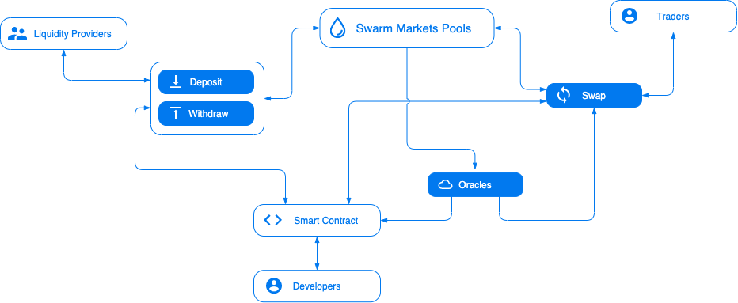

# Market Participants

Participants in the Swarm ecosystem are primarily comprised of three groups of users:

#### Liquidity Providers (LPs)

Anyone qualified via [passport](../core-concepts/passport.md) can be a liquidity provider. LPs contribute [ERC-20](https://eips.ethereum.org/EIPS/eip-20) tokens to a liquidity pool on Swarm, and are incentivized by receiving a prorated portion of the pool fees taken from the token swaps within that pool. LPs can also create new pools for any tokens qualified for the platform and allow other LPs to join the pool (coming soon). The profile for liquidity provider ranges from passive LPs (who accumulate fees as income), to professional LPs (who do active market making and arbitrage to other markets), to token issuers (who create market liquidity for their own projects).

#### Traders

Traders can swap their tokens for other tokens in a pool for a fee specific to the pool. Traders can be individuals, entities or software bots. Traders can choose from a diverse set of pools, each presenting a unique set of trading conditions set through particular configurations (number and type of tokens, weights, and fees). The profile for traders ranges from professionals (who look for token exchanges at favorable rates and compliance confidence), to arbitrators (who seek profit from inefficiencies between DEXs or CEXs) and Ethereum smart contracts (who seek programmatic liquidity, e.g. for liquidating positions on other protocols, automated trades on behalf of users, etc.).

#### Developers

Developers can integrate directly with Swarm's smart contracts to power new and exciting interactions with tokens, trading interfaces, retail experiences, and more.

The interplay between pool settings, pool volume, and external prices generates market forces which incentivize traders and liquidity providers to maintain stable token ratios, thereby preserving value for liquidity providers.
