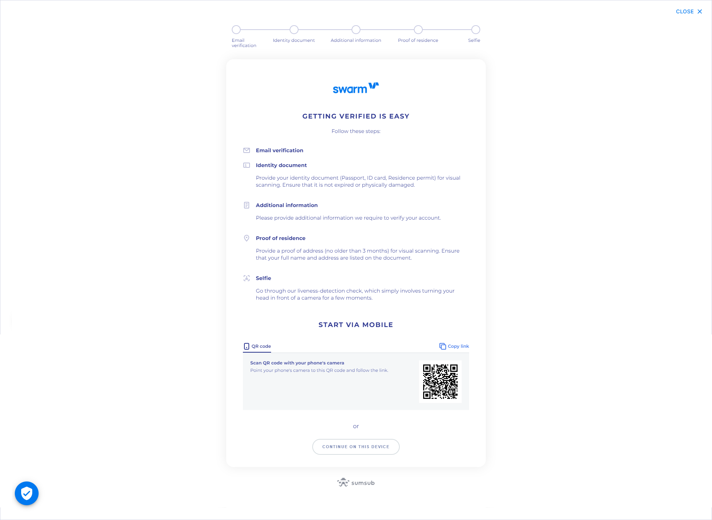

# Onboarding API

### Introduction 

Swarm’s Onboarding API allows partners to onboard users to regulatory compliant digital securities’ trading infrastructure, leveraging Swarm’s licenses.

<mark style="background-color:blue;">Note: Onboarding API is intended to serve partners who do not have their own KYC provider. For partners with a KYC provider, we will soon provide a KYC Sharing API.</mark>

Via Onboarding API, partners can initialize an onboarding experience embedded in their own infrastructure. The onboarding flow leads users through an identity verification flow, allowing them to submit documents and information, and also allows tracking the status of the onboarding. Once verified, users are permissioned to interact with Swarm’s digital assets on the Polygon network.

We have two environments:

* Sandbox (Mumbai): This is only needed when testing out your integration with Swarm. No real checks are performed when in the sandbox environment and all transactions are executed on the free Polygon Testnet - Mumbai.
* Production (Polygon): For integrations ready to go live. In order to provide you with access to the production environment, we require that the integration is tested first.

### API Integration Overview 

The goal of this overview is to give you an idea of how the whole flow looks. Contact us for access to the detailed technical reference documentation.

Onboarding a new user to trade regulated digital securities requires them to obtain two permissions, granted as non-transferable NFTs to the user’s address.

Specifically, the permissions required are as follows, and obtaining both permissions is initiated via the API.

1. KYC
2. Source of Funds

Users require **both permissions** to trade securities (stocks, index tokens, bonds etc…).

<figure><figcaption></figcaption></figure>

#### Verification Flow (KYC and Source of Funds) 

<figure><figcaption></figcaption></figure>

#### Requirements 

To get started, you first need to implement Swarm’s Onboarding WebSDK into your application.

#### Integration Steps 

* Step 1: Contact partners@swarm.com to get access to technical documentation (API Reference)
* Step 2: Obtain testnet keys from Swarm
* Step 3: Add ready-to-use Onboarding SDK and Source of Funds form to your application
* Step 4: Integrate with Swarm’s endpoints and use your testnet key to initiate an onboarding session
* Step 5: Verify correct integration together with Swarm
* Step 6: Obtain production keys and go live!

### &#x20;

### Implementation Examples 

#### KYC 

A KYC verification flow may be initiated from a user action (clicking a “Get verified” button) or upon initial registration. The flow is fully standalone and for the best experience, it should be opened in a new window. Users may select to go through the steps on a desktop or handover to a mobile device at any point. Users may track their own progress after submitting their information.

#### Source of Funds 

Users are required to provide a document (such as a bank statement) to verify the source of funds for the value of transactions they intend to make, and provide responses to a set of Investor Suitability and ESG (Environmental, Social, & Governance) questions. It is recommended to provide users a form which presents the questions and collects the responses, which are subsequently relayed to Swarm via API to obtain the Source of Funds permission token.

See below for implementation ideas:

 

### Further technical information 

Refer to [http://docs.onboarding.swarm.com/](http://docs.onboarding.swarm.com/) for detailed API endpoints and integration instructions.
